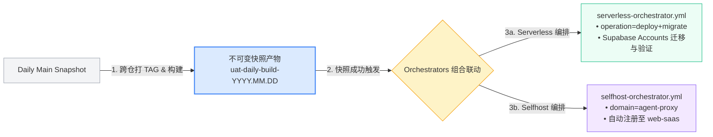

  

<h1 align="center">ai-workspace-infra</h1>

<strong>下一代云原生基础设施与 AI 工作区底座 | Cloud-Native Infrastructure & AI Workspace Foundation</strong>

  
  
  
  
  

  <a href="#-中文">中文</a> ｜ <a href="#-english">English</a>

---

## 🏛️ 四大核心支柱 | Four Core Pillars

<table>
<tr>
<td width="25%" align="center" valign="top">
  <h3>☁️ IaC & GitOps</h3>
  
<strong>声明式多云基座</strong>

  
基于 Terraform 与 GitOps 统一纳管 GCP / AWS / VPS 多云资产，严防环境漂移，一切变更可追溯。

</td>
<td width="25%" align="center" valign="top">
  <h3>⚡ CI/CD Engine</h3>
  
<strong>全自动组合式交付</strong>

  
不可变 Daily 快照封包，Serverless 与 Self-Host 双轨联动编排，自动数据迁移与服务注册。

</td>
<td width="25%" align="center" valign="top">
  <h3>🛡️ Zero-Trust</h3>
  
<strong>零信任安全鉴权</strong>

  
GitHub OIDC 与 HashiCorp Vault 深度集成，按环境隔离动态签发短期凭证，零代码库明文密钥。

</td>
<td width="25%" align="center" valign="top">
  <h3>🤖 AI & Runtime</h3>
  
<strong>智能控制面与数据</strong>

  
基于 MCP 协议连接 AI Agent，结合全链路可观测性与 PostgreSQL + pgvector 向量存储底座。

</td>
</tr>
</table>

---

## 🔄 组合式 CI/CD 自动化交付流水线 | Composite CI/CD Delivery Pipeline

1. **Daily Main Snapshot**：完成跨仓库协同打 Tag 与构建，生成唯一的不可变快照（`uat-daily-build-YYYY.MM.DD[-rN]`）。
2. **状态判定与 Tag 解析**：仅当完整 UAT 快照构建成功时，解析确定性不可变版本标识。
3. **组合联动编排触发**：
   - **`serverless-orchestrator.yml`**：指定 `operation=deploy+migrate`、`vault_env_path=uat`，部署应用并自动执行 Supabase Accounts 数据迁移与健康验证。
   - **`selfhost-orchestrator.yml`**：针对 `agent-proxy` 业务域执行 `operation=deploy`（`vault_env_path=uat`），部署完成后自动注册至 `serverless-orchestrator.yml` 所交付的 `web-saas` 服务中。

---

## 📦 核心仓库矩阵 (11 Repositories)

| 仓库 (Repository) | 类型 / 定位 | 说明 / 功能特性 |
| :--- | :--- | :--- |
| [`gitops`](https://github.com/ai-workspace-infra/gitops) | `GitOps Engine` | 声明式环境编排与状态收敛中心（SIT / UAT / PROD 多环境隔离与 Compose 状态机） |
| [`playbooks`](https://github.com/ai-workspace-infra/playbooks) | `Ansible Automation` | 基于 CMDB 动态资产的 Ansible 编排与主机状态机交付，杜绝硬编码 IP |
| [`platform-ops-toolkit`](https://github.com/ai-workspace-infra/platform-ops-toolkit) | `AI Ops & CLI` | 基于 AI 驱动的迁移自动化与平台运维工具箱，加速跨云纳管与故障排查 |
| [`iac_modules`](https://github.com/ai-workspace-infra/iac_modules) | `Terraform Modules` | 面向多云环境（GCP / AWS / Contabo / 自建）和混合基础设施的一体化 IaC 模块库 |
| [`artifacts`](https://github.com/ai-workspace-infra/artifacts) | `Artifact Registry` | 不可变构建产物、GHCR 容器镜像分发与 Daily-Build 快照版本发布中枢 |
| [`Infrastructure-MCP-Server`](https://github.com/ai-workspace-infra/Infrastructure-MCP-Server) | `AI Agent Control Plane` | 面向 AI Agent 基础设施调度的 Model Context Protocol (MCP) 标准控制面服务 |
| [`.github`](https://github.com/ai-workspace-infra/.github) | `Workflow & Security` | 全局标准 CI/CD Reusable Workflows、OIDC + Vault 零信任身份鉴权基线 |
| [`diagram-generator`](https://github.com/ai-workspace-infra/diagram-generator) | `Diagrams as Code` | 代码化架构拓扑与 CI/CD 交付全链路自动化可视化渲染引擎 |
| [`docs`](https://github.com/ai-workspace-infra/docs) | `Architecture & Manifest` | 架构设计白皮书、交付清单 (`DELIVERY-MANIFEST.md`) 与运维标准规范 |
| [`observability.svc.plus`](https://github.com/ai-workspace-infra/observability.svc.plus) | `Telemetry Foundation` | 覆盖 Metrics、Logs、Traces 的端到端全链路可观测性方案（Grafana / Loki / Vector） |
| [`postgresql.svc.plus`](https://github.com/ai-workspace-infra/postgresql.svc.plus) | `Database & Vector` | 生产级高可用 PostgreSQL + pgvector 向量数据库，为 AI 应用提供坚实状态基座 |

---

<h2 style="display: inline;">🇨🇳 中文概览</h2>

 

`ai-workspace-infra` 是 AI Workspace Lab 的基础设施与平台工程组织。我们围绕多云、混合云与本地工作区场景，构建可复用、可观测、可审计、可持续演进的底层能力，让平台服务、开发协作与安全交付在同一套控制面里高效运行。

### 我们的使命与交付准则

- **声明式与一致性**：多云基础设施均由 IaC 与 GitOps 驱动，杜绝手工配置漂移。
- **不可变构件与版本追踪**：CI 阶段只读验证，CD 阶段消费唯一快照，严禁原地篡改。
- **零信任安全基线**：无明文密钥存储，全流程通过 GitHub OIDC 与 Vault 动态签发凭据。
- **AI 智能赋能**：通过 MCP 协议与向量基座，实现基础设施层与 AI Agent 的原生无缝互联。

### 常用访问入口

- **平台服务主页**: [Open-Platform](https://console.svc.plus/products/open-platform)
- **组织主页**: [GitHub - ai-workspace-infra](https://github.com/ai-workspace-infra)

 

<h2 style="display: inline;">🌐 English Overview</h2>

 

`ai-workspace-infra` is the infrastructure and platform engineering organization behind AI Workspace Lab. We build reusable, observable, auditable, and evolvable foundations for multi-cloud, hybrid-cloud, and local workspace scenarios, enabling unified control, seamless developer collaboration, and secure delivery.

### Mission & Engineering Principles

- **Declarative & Consistent**: Multi-cloud resources driven by IaC and GitOps to eliminate configuration drift.
- **Immutable Artifacts**: Read-only verification in CI and immutable artifact consumption in CD pipelines.
- **Zero-Trust Security**: No long-lived secrets in repos; dynamic ephemeral credentials via GitHub OIDC and Vault.
- **AI-Native Enablement**: Native integration with AI Agents via the Model Context Protocol (MCP) and pgvector foundations.

### Quick Links

- **Platform Homepage**: [Open-Platform](https://console.svc.plus/products/open-platform)
- **Organization Page**: [GitHub - ai-workspace-infra](https://github.com/ai-workspace-infra)

---

  <strong>安全 · 开放 · 可扩展 · 可观测 · AI 驱动</strong> 
  Secure · Open · Scalable · Observable · AI-Powered

