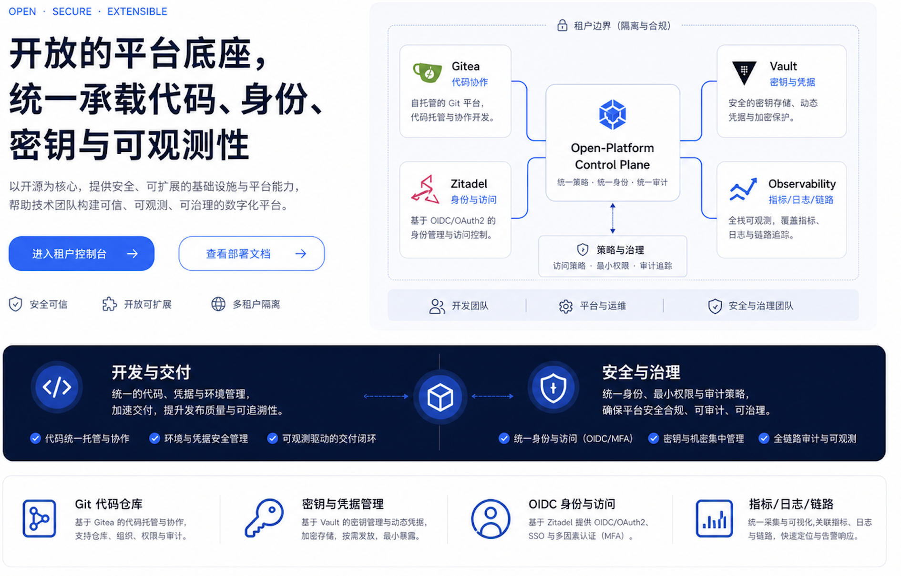

  

<h1 align="center">ai-workspace-infra</h1>

<strong>云原生基础设施与 AI 工作区底座 | Cloud-native infrastructure for AI workspaces</strong>

  
  
  
  

<table>
<tr>
<td valign="top" width="50%">

## 中文

`ai-workspace-infra` 是 AI Workspace Lab 的基础设施与平台工程组织。我们围绕多云、混合云与本地工作区场景，构建可复用、可观测、可审计、可持续演进的底层能力，让平台服务、开发协作与安全交付在同一套控制面里高效运行。

### 我们在做什么

- 构建面向多云环境的一体化 DevOps 与 GitOps 工具集
- 提供平台级服务能力，包括代码托管、身份认证、密钥管理与可观测性
- 让基础设施、应用交付和运维流程保持声明式、标准化和可追踪
- 支持 AI Workspace Lab 的本地控制台、运行时、网关与平台服务联动

### Open-Platform

我们的主页以 `Open-Platform` 为核心，目标是提供一个统一的开放控制平面：

- `Gitea`：代码托管与协作
- `Vault`：密钥与机密管理
- `IAM (Zitadel)`：身份认证与访问控制
- `Observability`：全局可观测性底座

### 核心能力

- GitOps 驱动的基础设施声明式管理
- 云原生组件编排与标准化部署
- 安全治理、权限控制与机密保护
- 指标、日志、链路的统一观测
- 面向平台团队的自动化运维与发布流程

### 相关仓库

- [`iac_modules`](https://github.com/ai-workspace-infra/iac_modules)
- [`gitops`](https://github.com/ai-workspace-infra/gitops)
- [`playbooks`](https://github.com/ai-workspace-infra/playbooks)
- [`observability.svc.plus`](https://github.com/ai-workspace-infra/observability.svc.plus)
- [`postgresql.svc.plus`](https://github.com/ai-workspace-infra/postgresql.svc.plus)
- [`artifacts`](https://github.com/ai-workspace-infra/artifacts)

### 访问入口

- 平台主页: [Open-Platform](https://console.svc.plus/products/open-platform)
- 组织主页: [GitHub - ai-workspace-infra](https://github.com/ai-workspace-infra)

</td>
<td valign="top" width="50%">

## English

`ai-workspace-infra` is the infrastructure and platform engineering organization behind AI Workspace Lab. We build reusable, observable, auditable, and evolvable foundations for multi-cloud, hybrid-cloud, and local workspace scenarios, so platform services, developer collaboration, and secure delivery can run on one shared control plane.

### What we do

- Build a unified DevOps and GitOps toolkit for multi-cloud environments
- Provide platform-grade services for code hosting, identity, secrets, and observability
- Keep infrastructure, delivery, and operations declarative, standardized, and traceable
- Support the local console, runtimes, gateways, and platform services in AI Workspace Lab

### Open-Platform

Our homepage centers on `Open-Platform`, a unified open control plane built around:

- `Gitea` for code hosting and collaboration
- `Vault` for secrets and credential management
- `IAM (Zitadel)` for identity and access control
- `Observability` as the global telemetry foundation

### Core capabilities

- Declarative infrastructure management with GitOps
- Cloud-native orchestration and standardized deployments
- Security governance, access control, and secret protection
- Unified metrics, logs, and tracing visibility
- Automation for platform teams across delivery and operations

### Related repositories

- [`iac_modules`](https://github.com/ai-workspace-infra/iac_modules)
- [`gitops`](https://github.com/ai-workspace-infra/gitops)
- [`playbooks`](https://github.com/ai-workspace-infra/playbooks)
- [`observability.svc.plus`](https://github.com/ai-workspace-infra/observability.svc.plus)
- [`postgresql.svc.plus`](https://github.com/ai-workspace-infra/postgresql.svc.plus)
- [`artifacts`](https://github.com/ai-workspace-infra/artifacts)

### Entry points

- Platform homepage: [Open-Platform](https://console.svc.plus/products/open-platform)
- Organization page: [GitHub - ai-workspace-infra](https://github.com/ai-workspace-infra)

</td>
</tr>
</table>

---

  <strong>安全 · 开放 · 可扩展 · 可观测</strong>

  <strong>Secure · Open · Scalable · Observable</strong>

