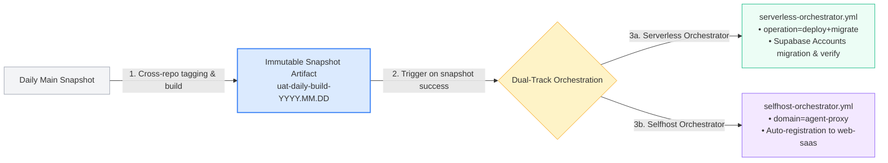

  

<h1 align="center">ai-workspace-infra</h1>

<strong>Next-Gen Cloud-Native Infrastructure & AI Workspace Foundation</strong>

  
  
  
  
  

  <a href="https://github.com/ai-workspace-infra/.github/blob/main/profile/README.md">🇨🇳 简体中文版</a> ｜ <strong>🌐 English Version</strong>

---

## 🌐 Organization Overview

`ai-workspace-infra` is the infrastructure and platform engineering organization behind AI Workspace Lab. We build reusable, observable, auditable, and evolvable foundations for multi-cloud, hybrid-cloud, and local workspace scenarios, enabling unified control, seamless developer collaboration, and secure delivery.

### Mission & Engineering Principles

- **Declarative & Consistent**: Multi-cloud resources are driven by IaC and GitOps to eliminate configuration drift.
- **Immutable Artifacts & Version Tracing**: Read-only verification in CI and immutable artifact consumption in CD pipelines.
- **Zero-Trust Security Baseline**: No plain-text secrets in repos; dynamic ephemeral credentials issued via GitHub OIDC and Vault.
- **AI-Native Enablement**: Native integration with AI Agents via the Model Context Protocol (MCP) and pgvector foundations.

### Quick Links

- **Platform Homepage**: [Open-Platform](https://console.svc.plus/products/open-platform)
- **Organization Page**: [GitHub - ai-workspace-infra](https://github.com/ai-workspace-infra)

---

## 🏛️ Four Core Pillars

<table>
<tr>
<td width="25%" align="center" valign="top">
  <h3>☁️ IaC & GitOps</h3>
  
<strong>Declarative Multi-Cloud Base</strong>

  
Unified management for GCP / AWS / VPS multi-cloud assets via Terraform & GitOps, strictly preventing drift.

</td>
<td width="25%" align="center" valign="top">
  <h3>⚡ CI/CD Engine</h3>
  
<strong>Automated Delivery Flow</strong>

  
Immutable Daily Snapshots, dual-track orchestration with Serverless & Selfhost, automated DB migrations.

</td>
<td width="25%" align="center" valign="top">
  <h3>🛡️ Zero-Trust</h3>
  
<strong>Vault Zero-Secret Auth</strong>

  
Deep integration between GitHub OIDC and HashiCorp Vault, issuing environment-isolated short-lived tokens.

</td>
<td width="25%" align="center" valign="top">
  <h3>🤖 AI & Runtime</h3>
  
<strong>MCP Control Plane & DB</strong>

  
Connecting AI Agents via MCP protocol, combined with full-stack observability and PostgreSQL + pgvector storage.

</td>
</tr>
</table>

---

## 🔄 Composite CI/CD Delivery Pipeline

1. **Daily Main Snapshot**: Collaboratively creates cross-repository tags and builds, producing a unique immutable snapshot (`uat-daily-build-YYYY.MM.DD[-rN]`).
2. **State Gate & Tag Resolution**: Only when the complete UAT snapshot succeeds, resolves the deterministic immutable version tag.
3. **Trigger Dual-Track Orchestrations**:
   - **`serverless-orchestrator.yml`**: Configured with `operation=deploy+migrate` and `vault_env_path=uat`, deploys application and automatically runs Supabase Accounts data migration & health verification.
   - **`selfhost-orchestrator.yml`**: Targets the `agent-proxy` domain with `operation=deploy` (`vault_env_path=uat`), automatically registering `agent-proxy` with the `web-saas` service deployed by the serverless orchestrator.

---

## 📦 Core Repositories Matrix (11 Repositories)

| Repository | Role / Type | Description / Key Capabilities |
| :--- | :--- | :--- |
| [`gitops`](https://github.com/ai-workspace-infra/gitops) | `GitOps Engine` | Declarative environment orchestration and multi-env convergence (SIT / UAT / PROD) |
| [`playbooks`](https://github.com/ai-workspace-infra/playbooks) | `Ansible Automation` | CMDB dynamic asset-driven Ansible orchestration and host state machine delivery |
| [`platform-ops-toolkit`](https://github.com/ai-workspace-infra/platform-ops-toolkit) | `AI Ops & CLI` | AI-powered migration automation and platform operations CLI toolkit |
| [`iac_modules`](https://github.com/ai-workspace-infra/iac_modules) | `Terraform Modules` | Unified IaC Terraform module library for multi-cloud (GCP / AWS / Contabo / Bare-Metal) |
| [`artifacts`](https://github.com/ai-workspace-infra/artifacts) | `Artifact Registry` | Immutable release artifacts, GHCR container image distribution, and Daily-Build registry |
| [`Infrastructure-MCP-Server`](https://github.com/ai-workspace-infra/Infrastructure-MCP-Server) | `AI Agent Control Plane` | Standard Model Context Protocol (MCP) infrastructure server for AI Agent scheduling |
| [`.github`](https://github.com/ai-workspace-infra/.github) | `Workflow & Security` | Global reusable CI/CD workflows and OIDC + Vault zero-trust security baseline |
| [`diagram-generator`](https://github.com/ai-workspace-infra/diagram-generator) | `Diagrams as Code` | Automated diagram rendering engine for topology and CI/CD delivery pipelines |
| [`docs`](https://github.com/ai-workspace-infra/docs) | `Architecture & Manifest` | Architecture whitepapers, delivery manifests (`DELIVERY-MANIFEST.md`), and SOPs |
| [`observability.svc.plus`](https://github.com/ai-workspace-infra/observability.svc.plus) | `Telemetry Foundation` | End-to-end full-stack observability (Metrics, Logs, Traces via Grafana / Loki / Vector) |
| [`postgresql.svc.plus`](https://github.com/ai-workspace-infra/postgresql.svc.plus) | `Database & Vector` | Production-ready HA PostgreSQL + pgvector vector database for AI workloads |

---

  <strong>Secure · Open · Scalable · Observable · AI-Powered</strong> 
  安全 · 开放 · 可扩展 · 可观测 · AI 驱动

